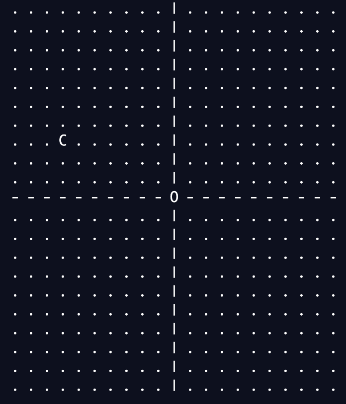

# Random Walk Assignment Instructions

View a sample running [here](https://replit.com/@stefanfritz/Walkers-and-Positions-sample-execution-from-jar-files2#instructions.md) 

For this mini-project you will create a simple game using your knowledge of classes (and other concepts). You will create two disctinct classes `Position.java` and `Walker.java`.

The object of the game is to be the closest to home (the origin) in a coordinate system after talking 5 walks of random length in user-chosen directions (N, S, E, W).

## `Position` Class

This class contains information about a location on the coordinate plane. Create the class with the following requirements:

### Instance Variables

There are two of them, both private, both integers:

1. x
2. y

### Constructor methods

Create two contructor methods with the following requirements:

1. One that takes two parameters to initialize the `x` and `y` instance variables
2. A default constructor which sets `x` and `y` both to zero.

### Other Class Methods

Below are the methods you will need to create for the `Position` class. For each method, be sure to think about what the method signature shold be as you create them. 

1. Create *accessor* methods **and** *mutator* methods (getters and setters) for both instance variables.
2. A `toString()` method which returns a `String` in the form: `"(3, 2)"`
3. An `equals(Position other)` method which returns `true` if both `Position` objects have the same coordinate.
4. A method `getDistanceToZero()` which returns a `double` equal to the straight-line distance to the origin. (Shouts to Pythagorous)

## `Walker` class

This class describes the player's status in the game.

### Instance variables

- `name` (`String`)
- `positon` (`Position`)

### Constrctor Method

There is one constructor method which takes two parameters `theName` and `thePosition` to initizlize the `name` and `position` instance variables, respectively.

### Other Class Methods

For each of the class methods, you will have to determine the appropriate access specifier. A good way to detmine if something is public or private is to ask *will this method be used outside of the class?*

1. `moveNorth(int dist)` -> modifies the the `Position` object in the northernly direction by the amount `dist`
2. `moveSouth(int dist)` --> like `moveNorth()` but south.
3. `moveWest(int dist)` --> like `moveNorth()` but west.
4. `moveEast(int dist)` --> like `moveNorth()` but east.
5. `move(String direction, int dist)` --> called from the `Main` class, this method moves the player in the direction specified by the `direction` parameter.
6. `closerToHome(Walker other)` returns `true` if `this` `Walker`'s distance to the orgin is shorter than `other`.
7. *Accessor* methods **only** for `name` and `position`.
8. `toString()` method which returns a `String` of the format `"Sally is located at Position (2, 4)"`

## `Main` Class

To create the `Main` class, you have two options:

1. (**challenge**) re-create the functionality of the example program yourself by coding the entire `Main` class. In this case, you will copy and paste the [Main-starter-code](https://replit.com/@R2-APCSA-Fritz-23-24/Project-Walkers-and-Positions#Main-starter-code.md) code into your `Main.java` file.
2. (**easy**) copy and paste the full `Main`class from the [Main-full-code](https://replit.com/@R2-APCSA-Fritz-23-24/Project-Walkers-and-Positions#Main-full-code.md) file into the `Main.java` file.

## Extensions

If you're feeling up for the challenge, make your game even sweeter by doing any of the following:

- After the game, state which player made it furthest away from (0, 0) during the entire game.
    - create an instance variable `maxDistance` which keeps track of the longest distance recorded by a player
- Replace the text printout with a visualization of the player's positions. 
- Create a points system that determines the winner rather than *just* ending closest to the center. Some ideas (feel free to change points):
    - 10 points for getting furthest from the origin
    - 10 points for ending closes to the origin
    - 5 points for moving at least once in each direction
    - 4 points for never moving the same direction in two consecutive turns
    - 3 points per quadrant visited
    - 15 points for landing on a point where y = x
